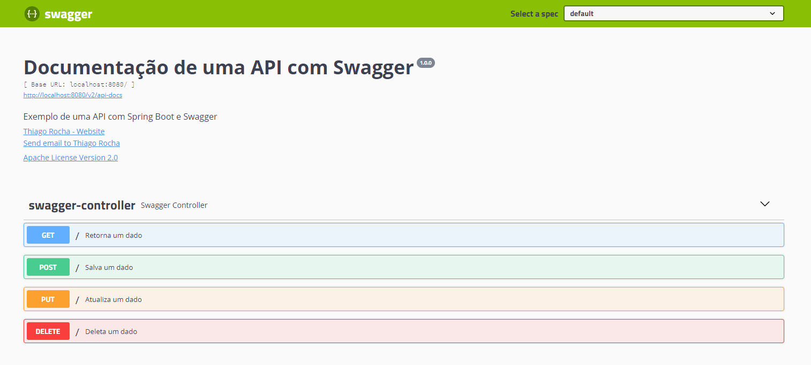

# *Documentação de uma API com Swagger*

### Abaixo explicarei o passo a passo para documentar uma API com o Swagger

1. Primeiramente será necessário add no projeto as duas dependências abaixo:

io.springfox:springfox-swagger2:2.9.2  
io.springfox:springfox-swagger-ui:2.9.2

2. No seu arquivo application.properties será necessário add a propriedade abaixo (com as últimas versões do springfox-swagger, foi necessário essa configuração):

spring.mvc.pathmatch.matching-strategy=ant_path_matcher

3. Crie uma classe de configuração para o Swagger e habilite o Swagger com a anotação @EnableSwagger2, após isso crie um Bean do Spring conforme abaixo:             

      public Docket docket(){  
      return new Docket(DocumentationType.SWAGGER_2)   
      .select()
      .apis(RequestHandlerSelectors.basePackage("com.example.swagger.controller"))    
      .paths(PathSelectors.any())  
      .build()  
      .apiInfo(apiInfo());}

4. Após essa configuração e com o end-point da sua aplicação, execute o projeto e acesse a url: http://localhost:8080/swagger-ui.html

